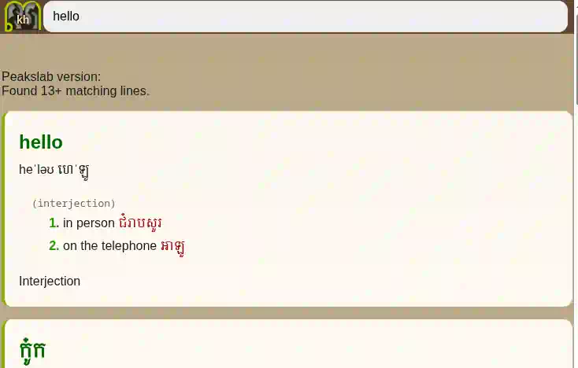
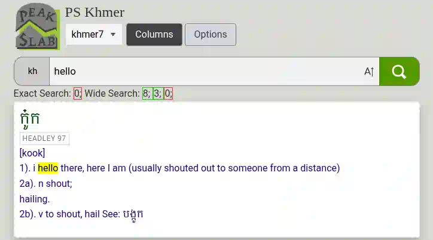

# PeakSlab

Defeating AI by making knowledge accessible to Humans.

See it <a href="https://peakslab.org">live</a>.

A project to make offline (PWA) dictionary webapps and tools for building those for obscure languages.

Current languages:
- Khmer (Cambodian)
- English (This is mainly so that we can load English resources to combine with other dictionaries.)
- Lao (Laos)
- Chitonga (Tonga)
- Lozi (Silozi)
- German
- Spanish
- Indonesian
- Levantine (Lebanese Arabic)

# Using PeakSlab
For the fullest example, try [PeakSlab.org/khmer](https://peakslab.org/khmer/) and enter something in the search bar. It'll search as you type pulling in definitions from all the dictionaries that you had enabled on the page. If you want to change the dictionaries loaded, simply clear the search bar and the Dictionary list will appear and you can enable and disable them individually.

When you're searching something, e.g. `Gen 7` and you want to look up a word without losing your spot, select the word and push the *popup* button.

If your system supports text to speech you'll also see options for that. The funnest thing you can do is select English text and have the Khmer TTS read it in a Khmer accent.

The Khmer dictionary page is really the prototype and the reason for every other dictionary page.

The files will be cached to your device, automatically, but since they're compressed it's not too bad. The 20 or so dictionaries included in the Khmer page are about 53mb all together. (26mb of that is the *Kora Praise* one because that has 1500 sheet music scans in it. I did not compress that file because it's negligible savings and the file is so big any way)

# AI Rant

People go through great effort to gather proper data for AI to learn, so my question is, why don't we make knowledge and data accessible to humans instead so that we can learn? I'm sick of people using AI as a dictionary, it's slow, internet dependent, prone to hallucinations, and untrustworthy. The only advantage AI has versus us is more data and better ways to access it, so let's remedy that.

# Mobile Benchmark
For these tests I ran my laptop connected to my Phone's hotspot to serve the page. Files are cached to my Moto G Power 2024 running Brave and the page is refreshed at > 5 second intervals to measure load time from cache.

## Load speed
| Format    | Loadtime | Speed | Filesize |
|-----------|----------|-------|----------|
| SQLite3   | 789ms    | 1.0x  | 84mb     |
| .peak     | 434ms    | 1.81x | 49mb     |
| .peak split | 385ms | 2.05x | 58mb     |
| .peak split (dual worker)| **379ms**  | **2.08x** | 58mb     |
| .peak.zst | 473ms    | 1.67x | **9.3mb**    |
| .peak.zst split | 537ms  | 1.47x | 11mb     |
| .peak.zst split (dual worker)| 418ms  | 1.89x | 11mb     |

## Format File size 
|  Format       | File size | Percentage |
|---------------|-----------|------------|
|.tsv (src file)| 52mb      | 100%       |
|SQLite3        | 84mb      | 162%       |
|.peak          | **49mb**      | **94%**        |
|.tsv (split)   | 60mb      | 115%       |
|.peak (split)  | 58mb      | 112%       |

### Compressed
|  Format       | File size | Percentage |
|---------------|-----------|------------|
|.tsv.zst       | **7.9mb**     | **15%**        |
|SQLite3.zst    | 14mb      | 27%        |
|.peak.zst      | 9.3mb     | 18%        |
|.tsv.zst (split)| 9.1mb    | 17%        |
|.peak.zst (split)| 11mb    | 21%        |

## Runtime size
|  Program        | Core   |   Glue  |  .html .js .css   |  Total |
|-----------------|--------|---------|-----------------|--------|
|PeakSlab SQLite3 | 851kb  | 391kb   |    **45kb**         | 1287kb |
|PeakSlab PeakSlab| **38kb (4%)**   | 0kb (0%)**    |    55kb (122%)         | **93kb (7%)** |

The SQLite3 version is the old version of PeakSlab before I wrote the custom file format. The advantages of the custom format are smaller file sizes, instant loading (cast to a struct), and versatile indexes. The reason that .peak slabs are smaller than .tsv files is because peak removes all capitalization and HTML tags and puts them in a tags (or dictionary) section to be reinserted on render.

As you can see the runtime is drastically smaller, the files are smaller, and the load speed is faster even with decompressing the files on every load. Loading uncompressed files is 1.81x faster or 2.08x faster if the files are split (even though the split files take up more space than the one). Even if we're loading compressed files, it's still 1.89x faster than SQLite3 loading uncompressed files.

# License

This project is under the GPL3 license.
This project uses the following libraries:
- <a href="https://github.com/facebook/zstd">Zstandard</a> (BSD License. See ZSTD_LICENSE.txt)
- <a href="https://github.com/ashvardanian/StringZilla">Stringzilla</a> (Apache 2.0 License. See STRINGZILLA_LICENSE.txt)

## Design Goals
- Client Side (Offline, power to the user)
- Modular (Can load and run many different dictionary files in parallel)
- Scalable (Same as above)
- Lightweight (Written from scratch)
- Fast (Loading and searching)
- Libre Open Source (GPL3)
- Simple (You just edit the source tsv file and then use peakgen to turn it into an indexed peak file. Or give it a full directory and it will generate a slab file with all the files in that folder). Each line is already it's own index item, but if you put an '@' anywhere it'll put everything after that as an item in the secondary index. '^' for tertiary index. Duplicate the '@' or '^' to escape them. To load a peak file we literally just cast the raw data to a struct, works great, this is why we write in C.
- Sane Defaults (Most relevant results first, fallback to less relevant)
- Powerful

## Peak file

This is a [custom format](docs/PEAK_FILE.md) built to be very fast to load (cast to a c-struct and done) and very fast to search with 3 binary search indexes built in. It's very similar to a TSV file and is generated from them.

A Peak file is not a database, there's no transactions or inserts or writes, just _reads_, as it should be for ultimate speed and simplicity.

These peak files can then be compressed using zstdandard compression which is very quick for decompressing and has a good compression ratio.

There's an <a href="https://peakslab.org/peakgen.html">online version of the PeakSlab Generator</a> because I hate when a dictionary converter stops working or has 100 dependencies and you can't compile it any more without rewriting it. (Only works for Peak files at the moment).

## Make it your own

You want to quickly set up a new language?
[Add a language](docs/ADD_LANGUAGE.md)

## Slab file

A Slab file is like a peak file except instead of the data being text it's binaries. That allows for storing lots of little files with searchable headers that can seamlessly be integrated into the results of a search.

## input file support
- tsv file
- WEBP images
- WEBM Opus audio
- JBIG2 images via custom wasm decoder (27kb)
Adding support for other filetypes is trivial, but for right now I just have the most efficient and easy to use formats.

## Completed Features
- System TTS integration
- Narrow and wide search
- Offline
- Selection Menu
- Online Peak Generator from .tsv source
- Glob search (* is indefinite number of wildcards, + is anywhere in the entry, ! negates, combine with *\* or +)

## Non-features
- No API, no POSTS, not scrapable by AI because it's all run clientside through javascript and wasm. (But if the AI was smart it'd just read the provided source tsv files.)
- No frameworks, no React, no npm, no jQuery, no typescript, just vanilla javascript and C code.

## Todo
- ~~Regex or Glob support~~
- Add a Codec2 audio decoder so we can get even smaller audio files.
- Add chunking and http ranges to the service worker's download logic so we can resume and track big downloads.
- Add search parameters so that we can quickly share searches.
- ~~Expand Exact Search to work with 2nd index too.~~
- make an online editor
- ~~media support in dictionary~~
- ~~ignore zero width spaces in search~~
- History and bookmarking
- ~~Selection to TTS~~
- Sheet music (ABC files)
- Remove javascript glue code for peak.wasm (peak.js).
- ~~JBIG2 image support~~
- ~~Cite sources~~
- Allow users to upload their own custom PeakSlab files which will stay cached in Indexeddb.
- ~~Rework databases~~
- Rewrite the AI's service worker.
- ~~Make it more modular to make porting languages and data easier.~~
- ~~Rewrite the AI's rust code in C~~
- ~~Bundle zstd compressor with peakgen.~~
- ~~Make an online peakgen.~~
- Add .slab support to online peakgen.
- ~~Fix strcmp bugs.~~
- ~~Fix context menu.~~
- Make a custom regex-like language for substitution and character unfolding.
- Make it so that files to be included in the slab file can have a metadata file so that there can be  attribution or alttext attached to the file.
- ~~Make the combiner combine the entries with the same headword in order~~
- Enable custom html for the combining of dictionary entries.

## Changes
- Added JBIG2 image support.
- Rewrote the interface to be more intuitive and simpler.
- Moved from SQLite's wasm backend to a brand new engine and file format. This format allows for really good compression and lightning fast speed as well as speed and lazy loading.

## History
- Be me, a missionary in Cambodia. All the Khmer dictionary apps are full of ads, or require internet connection or just incomplete. So I decide to make my own Khmer dictionary modules for Aard. The process is messy and it's difficult to share with other people. There's no  Aard dictionary app on iOS.
- Tried Stardict and other things, a lot of the programs were outdated and just didn't work anymore; so I decided to make my own.
- Tried SQLite, it worked pretty good. But the database files were too large and the runtime was too bloated. Editing databases was a pain. Left join right join all join? I figured out that github pages would send a compressed form if I saved the database file with a **.html** extension. Still downloads really slowly on iOS. Decide that I don't need all the features that SQLite offers, I just need to be able to read from the database. Also wanted the ability to remove tags and such from search without having duplicated data.
- Started using Grok to help me prototype a lot of ideas.
- Tried Pouchdb with javascript, too slow to load from a file.
- Tried rolling my own database from Javascript, parsing was too slow, startup too slow.
- Tried using indexeddb, was good, but writing to indexeddb is just too slow for the first run. Like really slow.
- Tried decompressing database files using decompression streams and gzip compression, still slower than SQLite's loading of uncompressed database.
- Switched to decompressing using a javascript zstd decompressor, speed was acceptable, but still slower than SQLite.
- Started using zstd wasm modules for decompression, good, but transferring the memory from wasm to javascript was incurring a cost or impossible to implement right.
- Because Grok sucks at writing C wasm modules I switched to rust for the wasm backend. Suddenly had really good speed, kept all the major processing in one wasm module. Thought that 150kb module was much better than the 1MB sqlite wasm module.
- Refactored everything to work with lazy loading and lazy searching to make the app more seamless and less inefficient.
- Rewrote everything from scratch in C because I understand it better, it's faster and most of my previous rust code was unsafe code anyway. Rewrote the html and javascript too. Got the size of the peak decoder binary from 150kb in rust to 52kb in C.
- Had 800mb of sheet music I wanted to compress down and looked around for jbig2 support. I could turn each page into a tiny pdf, but the pdfs don't open on mobile and I wanted them to show up just as an image with no controls or nonsense. Couldn't find any readily available jbig2 decoders for javascript or wasm. (Other than the ones inside pdf.js and pdfium etc. but getting those to work with my code wasn't happening. I tried using pdf.js but it was slow, huge, and still ugly. So I had Claude AI guide me through adapting ghostscript's jbig2dec. I was gonna use libpng but that made the wasm decoder 178kb, the largest part of PeakSlab yet. I didn't like that, so I had Claude write a new frontend to jbig2dec that did custom 1-bit PNG encoding from scratch. The wasm for that is down to 92kb and it works great.
- Changed some compile flags, got the core peak wasm module down to 37kb. Used Claude AI to remove jbig2.js for more space savings.
- Aggressively disabled code for the generation of jbig2.wasm, got it down to 26kb. 
- Started using walloc in order to remove emscripten glue code that was dependent on emmalloc. Got jbig2.wasm down to 17kb and peak.wasm down to 38kb with no glue required.
- Noticed that my peak.wasm module was being fetched and compiled multiple times, so I fixed that. After all that I noticed that loadtime was quite a bit faster and boosted decompression speeds.
